# Homework 1 - Pedro N B Rodrigues

## Question 1 - What airline is better to travel?

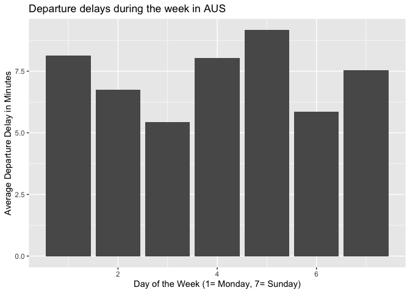
    If you are planning a trip starting on the Austin
International Airport, you should choose to depart on a Wednesday to
minimize departure delays.    
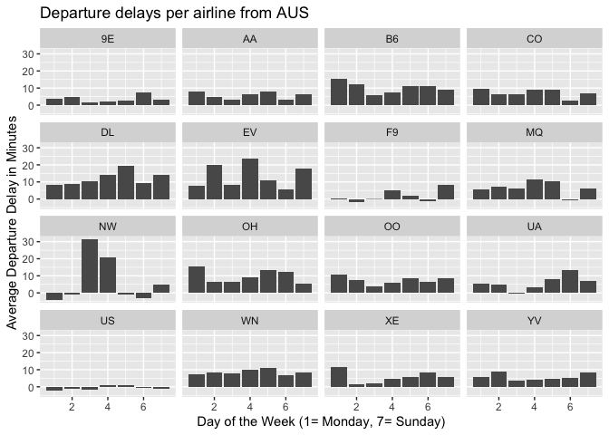
    However, when you are choosing between different airlines and
dates, choosing US Airways and departure on a Monday gives the smallest
departure delay.  
   

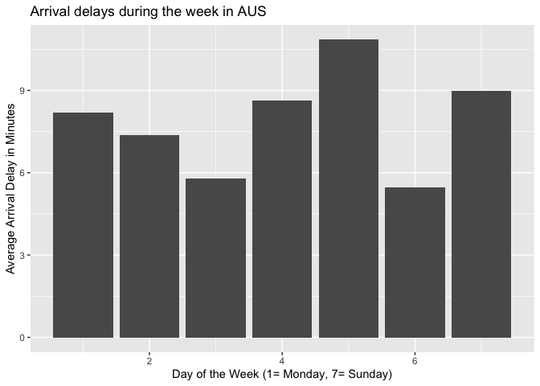
    When planing the way back to the Austin International Airport,
the best weekday to arrive is Saturday.  
   
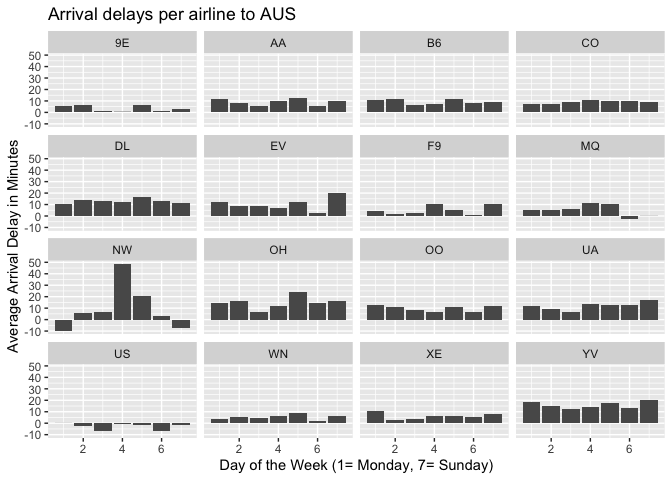
    Furthermore, the best arline for a trip returning to Austin is
US Airways on a Saturday. If I were to recommend a trip, from Austin and
returning to Austin, I would recommend leaving on a Monday and returning
on a Saturday, both ways through US Airways to minimize delays.  
   

## Question 2 - Billboard data

### A - Top 10 most popular songs since 1958

    ## `summarise()` has grouped output by 'performer'. You can override using the `.groups` argument.

    ## # A tibble: 10 x 3
    ## # Groups:   performer [10]
    ##    performer                           song                          total_count
    ##    <chr>                               <chr>                               <int>
    ##  1 Imagine Dragons                     Radioactive                            87
    ##  2 AWOLNATION                          Sail                                   79
    ##  3 Jason Mraz                          I'm Yours                              76
    ##  4 The Weeknd                          Blinding Lights                        76
    ##  5 LeAnn Rimes                         How Do I Live                          69
    ##  6 LMFAO Featuring Lauren Bennett & G… Party Rock Anthem                      68
    ##  7 OneRepublic                         Counting Stars                         68
    ##  8 Adele                               Rolling In The Deep                    65
    ##  9 Jewel                               Foolish Games/You Were Meant…          65
    ## 10 Carrie Underwood                    Before He Cheats                       64

  Top 10 songs that spent the most time in the top 100 billboard
songs.

 

### B - How many unique songs in top 100 per year?

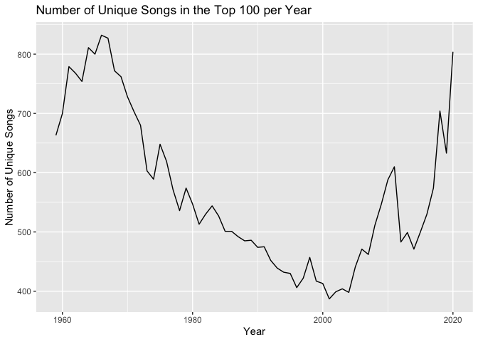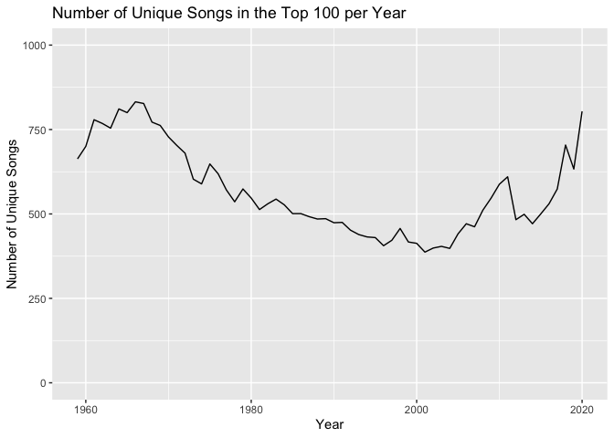
  The picture shows the change in unique songs that ever made to the
top 100 billboard songs of a given year. The number of unique songs in
the top 100 decreased over time from 1970 to early 2000s, while it grew
compared to previous years in both tails. That could be that during the
period of 1970 to 2000, less songs were written that had the quality to
reach the top 100, so old songs would stay in the top for longer.

 

### C - Artists with most ten-week hits.

    ## # A tibble: 19 x 2
    ##    performer             `count(performer)`
    ##    <chr>                              <int>
    ##  1 Billy Joel                            32
    ##  2 Brad Paisley                          30
    ##  3 Chicago                               31
    ##  4 Daryl Hall John Oates                 30
    ##  5 Drake                                 31
    ##  6 Elton John                            52
    ##  7 George Strait                         30
    ##  8 Jason Aldean                          30
    ##  9 Keith Urban                           36
    ## 10 Kenny Chesney                         42
    ## 11 Madonna                               44
    ## 12 Michael Jackson                       34
    ## 13 Neil Diamond                          30
    ## 14 Rascal Flatts                         31
    ## 15 Rod Stewart                           33
    ## 16 Stevie Wonder                         36
    ## 17 Taylor Swift                          35
    ## 18 The Rolling Stones                    33
    ## 19 Tim McGraw                            39

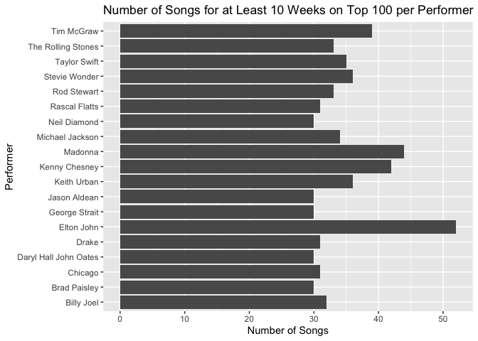
  Those are the 19 artists that had at least 10 songs present in the
top 100 for at least 10 weeks, making them some of the most successful
performers. You can see that Elton John is the performer who had the
most songs featuring for at least 10 weeks.

 

## Question 3

## A - 95th percentile for female competitors in Athletic events

    ## # A tibble: 1 x 1
    ##   q95_height
    ##        <dbl>
    ## 1        183

  The 95th percentile of height in female competitors in Athletic
events is 183cm.  

## B - Which event has the greatest variability in height?

    ## # A tibble: 132 x 3
    ##    event                                 newheight sd_height
    ##    <chr>                                     <dbl>     <dbl>
    ##  1 Rowing Women's Coxed Fours                 173.     10.9 
    ##  2 Basketball Women's Basketball              183.      9.70
    ##  3 Rowing Women's Coxed Quadruple Sculls      172.      9.25
    ##  4 Rowing Women's Coxed Eights                178.      8.74
    ##  5 Swimming Women's 100 metres Butterfly      173.      8.13
    ##  6 Volleyball Women's Volleyball              180.      8.10
    ##  7 Gymnastics Women's Uneven Bars             155       8.02
    ##  8 Shooting Women's Double Trap               169.      7.83
    ##  9 Cycling Women's Keirin                     170.      7.76
    ## 10 Swimming Women's 400 metres Freestyle      174.      7.62
    ## # … with 122 more rows

  The event with the highest variation in height is the Women’s Coxed
Fours event from the Rowing sport.

 

## C - Change in average age of Olympic Swimmers across all olympic history.

    ## # A tibble: 18 x 2
    ##     year year_fage
    ##    <int>     <dbl>
    ##  1  2000      22.5
    ##  2  2016      22.4
    ##  3  2008      22.3
    ##  4  2004      22.1
    ##  5  2012      22.0
    ##  6  1996      21.1
    ##  7  1988      19.3
    ##  8  1992      19.2
    ##  9  1984      18.9
    ## 10  1924      18  
    ## 11  1956      17.7
    ## 12  1968      17.5
    ## 13  1964      17.5
    ## 14  1960      17.3
    ## 15  1980      17.2
    ## 16  1976      17.2
    ## 17  1952      17  
    ## 18  1972      17

    ## # A tibble: 28 x 2
    ##     year year_mage
    ##    <int>     <dbl>
    ##  1  1924      32  
    ##  2  1912      27  
    ##  3  1920      26  
    ##  4  2012      24.6
    ##  5  2016      24.1
    ##  6  1928      23.5
    ##  7  1908      23.5
    ##  8  2008      23.4
    ##  9  1996      22.9
    ## 10  2004      22.8
    ## # … with 18 more rows

    ## `summarise()` has grouped output by 'year'. You can override using the `.groups` argument.

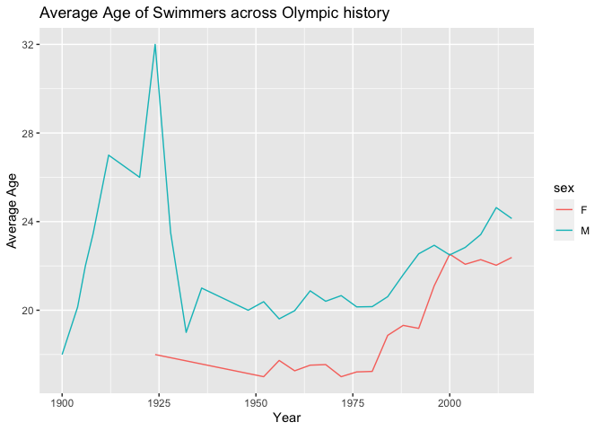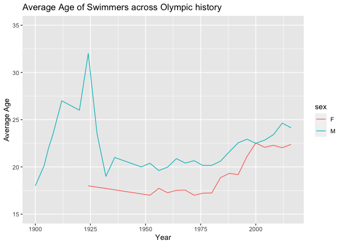
  The age of male swimmers grew until the 1924 Olympics, from them it
decreased until the 1932 Olympics. Since them there is a upwards trend
with some decreases. The female average age decrease until the 1952
Olympics and then it began a upwards trend. By comparing both trends, I
believe that there is very little difference in them, both have been
increasing in the past years.  

## Question 4

## 350 Trim Class

    ##             k       err  std_err
    ## result.4    8  9996.616 772.4039
    ## result.5   10 10044.418 762.5748
    ## result.6   15 10059.911 641.1989
    ## result.7   20 10127.164 589.8894
    ## result.3    6 10172.105 676.2115
    ## result.8   25 10199.365 548.4074
    ## result.12  45 10211.572 563.6546
    ## result.13  50 10227.402 554.2019
    ## result.10  35 10235.027 547.8350
    ## result.9   30 10240.773 534.3833
    ## result.11  40 10253.727 576.6554
    ## result.14  60 10388.165 510.1677
    ## result.15  70 10464.974 483.1962
    ## result.2    4 10543.179 698.9901
    ## result.16  80 10719.307 444.9334
    ## result.17  90 11007.765 415.2421
    ## result.18 100 11355.966 433.5912
    ## result.19 125 12445.899 460.7901
    ## result.1    2 12467.998 549.7316
    ## result.20 150 13596.986 511.0857
    ## result.21 175 14718.103 577.2078
    ## result.22 200 15764.149 627.3774
    ## result.23 250 17743.243 650.7534
    ## result.24 300 20549.303 674.1491

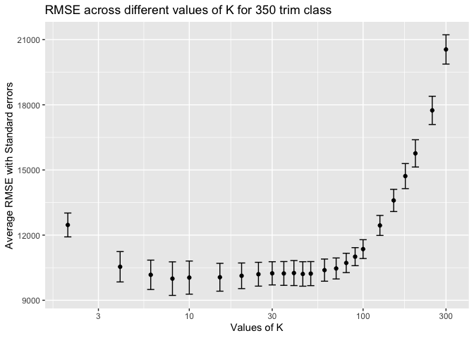

## 63 AMG Trim Class

    ##             k      err   std_err
    ## result.13  50 14421.36  481.5516
    ## result.12  45 14453.85  471.3655
    ## result.14  60 14466.25  495.9309
    ## result.15  70 14469.22  488.3377
    ## result.10  35 14483.65  478.7580
    ## result.11  40 14497.37  451.1036
    ## result.16  80 14545.81  527.9220
    ## result.9   30 14560.95  495.7041
    ## result.8   25 14590.49  518.6058
    ## result.17  90 14631.58  546.8661
    ## result.7   20 14671.17  521.7883
    ## result.18 100 14725.03  565.9257
    ## result.6   15 14767.37  496.0621
    ## result.19 125 15040.72  640.1895
    ## result.5   10 15104.48  490.9189
    ## result.4    8 15133.15  550.1249
    ## result.3    6 15325.80  484.9081
    ## result.20 150 15465.04  739.3964
    ## result.2    4 15921.29  437.7681
    ## result.21 175 15946.23  828.1545
    ## result.22 200 16418.12  900.5980
    ## result.1    2 16978.14  572.7841
    ## result.23 250 17430.68 1019.6617
    ## result.24 300 18475.76 1159.9871

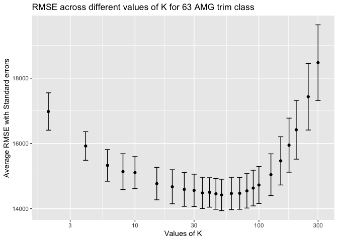

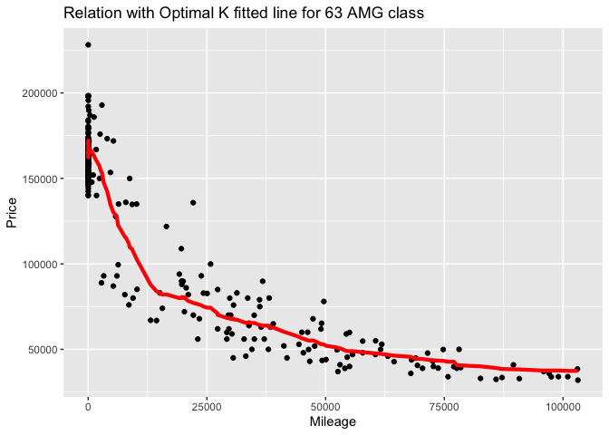
  The 65 AMG trim yields the largest optimal “k”, it could be due to
the fact that there are approximately three and a half times more
observations for 63 AMG trim cars than 350 trim cars, so it requires
more neighbors to achieve a more precise prediction, compared to the
other class. From the previous shown results, we can also see that the
optimal “k” for the 63 AMG trim class is also approximately three and a
half times the optimal “k” of the 350 trim class.  
