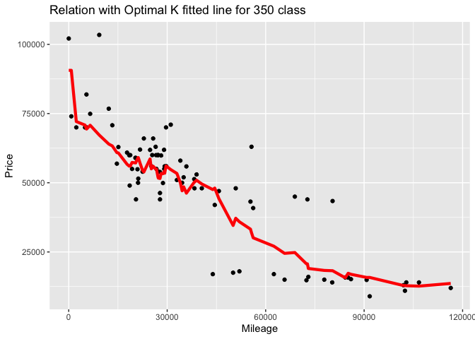
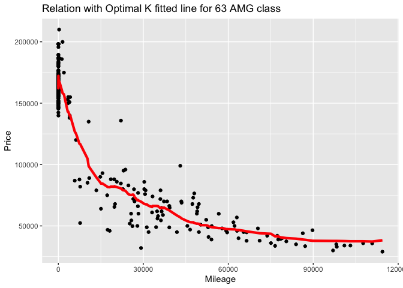

# Homework 1 - Pedro N B Rodrigues

## Question 1 - What airline is better to travel?

    ggplot(average_week_departure) + 
      geom_col(aes(x=DayOfWeek, y=average)) +
      labs(x='Day of the Week (1= Monday, 7= Sunday)',
           y= 'Average Departure Delay in Minutes',
           title= 'Departure delays during the week in AUS')

    If you are planning a trip starting on the Austin
International Airport, you should choose to depart on a Wednesday to
minimize departure delays.    

    ggplot(try) + 
      geom_col(aes(x=DayOfWeek, y=average)) + 
      facet_wrap(~UniqueCarrier) +
      labs(x='Day of the Week (1= Monday, 7= Sunday)',
           y= 'Average Departure Delay in Minutes',
           title= 'Departure delays per airline from AUS')

    However, when you are choosing between different airlines and
dates, choosing US Airways and departure on a Monday gives the smallest
departure delay.  
   

    ggplot(average_weak_arrival) + 
      geom_col(aes(x=DayOfWeek, y=average)) +
      labs(x='Day of the Week (1= Monday, 7= Sunday)',
           y= 'Average Arrival Delay in Minutes',
           title= 'Arrival delays during the week in AUS')

    When planing the way back to the Austin International Airport,
the best weekday to arrive is Saturday.  
   

    ggplot(try2) + 
      geom_col(aes(x=DayOfWeek, y=average)) + 
      facet_wrap(~UniqueCarrier) +
      labs(x='Day of the Week (1= Monday, 7= Sunday)',
           y= 'Average Arrival Delay in Minutes',
           title= 'Arrival delays per airline to AUS')

    Furthermore, the best arline for a trip returning to Austin is
US Airways on a Saturday. If I were to recommend a trip, from Austin and
returning to Austin, I would recommend leaving on a Monday and returning
on a Saturday, both ways through US Airways to minimize delays.  
   

## Question 2 - Billboard data

### A - Top 10 most popular songs since 1958

    billboard %>%
      group_by(performer, song) %>%
      summarize(total_count = n()) %>%
      arrange(desc(total_count)) %>%
      head(10)

    ## `summarise()` has grouped output by 'performer'. You can override using the `.groups` argument.

    ## # A tibble: 10 x 3
    ## # Groups:   performer [10]
    ##    performer                           song                          total_count
    ##    <chr>                               <chr>                               <int>
    ##  1 Imagine Dragons                     Radioactive                            87
    ##  2 AWOLNATION                          Sail                                   79
    ##  3 Jason Mraz                          I'm Yours                              76
    ##  4 The Weeknd                          Blinding Lights                        76
    ##  5 LeAnn Rimes                         How Do I Live                          69
    ##  6 LMFAO Featuring Lauren Bennett & G… Party Rock Anthem                      68
    ##  7 OneRepublic                         Counting Stars                         68
    ##  8 Adele                               Rolling In The Deep                    65
    ##  9 Jewel                               Foolish Games/You Were Meant…          65
    ## 10 Carrie Underwood                    Before He Cheats                       64

  Top 10 songs that spent the most time in the top 100 billboard
songs.

 

### B - How many unique songs in top 100 per year?

    ggplot(maybe) +
      geom_line(aes(x=year, y=unique)) +
      labs(x="Year",
           y="Number of Unique Songs",
           title="Number of Unique Songs in the Top 100 per Year")

    ggplot(maybe) +
      geom_line(aes(x=year, y=unique)) +
      ylim(0,1000) +
      labs(x="Year",
           y="Number of Unique Songs",
           title="Number of Unique Songs in the Top 100 per Year")

  The picture shows the change in unique songs that ever made to the
top 100 billboard songs of a given year. The number of unique songs in
the top 100 decreased over time from 1970 to early 2000s, while it grew
compared to previous years in both tails. That could be that during the
period of 1970 to 2000, less songs were written that had the quality to
reach the top 100, so old songs would stay in the top for longer.

 

### C - Artists with most ten-week hits.

    ten_week_hit %>%
      summarise(count(performer))

    ## # A tibble: 19 x 2
    ##    performer             `count(performer)`
    ##    <chr>                              <int>
    ##  1 Billy Joel                            32
    ##  2 Brad Paisley                          30
    ##  3 Chicago                               31
    ##  4 Daryl Hall John Oates                 30
    ##  5 Drake                                 31
    ##  6 Elton John                            52
    ##  7 George Strait                         30
    ##  8 Jason Aldean                          30
    ##  9 Keith Urban                           36
    ## 10 Kenny Chesney                         42
    ## 11 Madonna                               44
    ## 12 Michael Jackson                       34
    ## 13 Neil Diamond                          30
    ## 14 Rascal Flatts                         31
    ## 15 Rod Stewart                           33
    ## 16 Stevie Wonder                         36
    ## 17 Taylor Swift                          35
    ## 18 The Rolling Stones                    33
    ## 19 Tim McGraw                            39

    ggplot(ten_week_hit) + 
      geom_col(aes(x=performer, y=count(song_id))) +
      coord_flip() +
      labs(x="Performer",
           y="Number of Songs",
           title="Number of Songs for at Least 10 Weeks on Top 100 per Performer")

  Those are the 19 artists that had at least 10 songs present in the
top 100 for at least 10 weeks, making them some of the most successful
performers. You can see that Elton John is the performer who had the
most songs featuring for at least 10 weeks.

 

## Question 3

## A - 95th percentile for female competitors in Athletic events

    percentheight %>%
     summarise(q95_height = quantile(trueheight, 0.95))

    ## # A tibble: 1 x 1
    ##   q95_height
    ##        <dbl>
    ## 1        183

## B - Which event has the greatest variability in height?

    femheight %>%
      group_by(event) %>%
      summarise(newheight = mean(height),
                sd_height = sd(height)) %>%
      arrange(desc(sd_height))

    ## # A tibble: 132 x 3
    ##    event                                 newheight sd_height
    ##    <chr>                                     <dbl>     <dbl>
    ##  1 Rowing Women's Coxed Fours                 173.     10.9 
    ##  2 Basketball Women's Basketball              183.      9.70
    ##  3 Rowing Women's Coxed Quadruple Sculls      172.      9.25
    ##  4 Rowing Women's Coxed Eights                178.      8.74
    ##  5 Swimming Women's 100 metres Butterfly      173.      8.13
    ##  6 Volleyball Women's Volleyball              180.      8.10
    ##  7 Gymnastics Women's Uneven Bars             155       8.02
    ##  8 Shooting Women's Double Trap               169.      7.83
    ##  9 Cycling Women's Keirin                     170.      7.76
    ## 10 Swimming Women's 400 metres Freestyle      174.      7.62
    ## # … with 122 more rows

  The event with the highest variation in height is the Women’s Coxed
Fours event from the Rowing sport.

 

## C - Change in average age of Olympic Swimmers across all olympic history.

    swim_age %>%
      filter(sex=='F') %>%
      group_by(year) %>%
      summarise(year_fage = mean(age)) %>%
      arrange(desc(year_fage))

    ## # A tibble: 18 x 2
    ##     year year_fage
    ##    <int>     <dbl>
    ##  1  2000      22.5
    ##  2  2016      22.4
    ##  3  2008      22.3
    ##  4  2004      22.1
    ##  5  2012      22.0
    ##  6  1996      21.1
    ##  7  1988      19.3
    ##  8  1992      19.2
    ##  9  1984      18.9
    ## 10  1924      18  
    ## 11  1956      17.7
    ## 12  1968      17.5
    ## 13  1964      17.5
    ## 14  1960      17.3
    ## 15  1980      17.2
    ## 16  1976      17.2
    ## 17  1952      17  
    ## 18  1972      17

    swim_age %>%
      filter(sex=='M') %>%
      group_by(year) %>%
      summarise(year_mage = mean(age)) %>%
      arrange(desc(year_mage))

    ## # A tibble: 28 x 2
    ##     year year_mage
    ##    <int>     <dbl>
    ##  1  1924      32  
    ##  2  1912      27  
    ##  3  1920      26  
    ##  4  2012      24.6
    ##  5  2016      24.1
    ##  6  1928      23.5
    ##  7  1908      23.5
    ##  8  2008      23.4
    ##  9  1996      22.9
    ## 10  2004      22.8
    ## # … with 18 more rows

    swim_age = swim_age %>%
      group_by(year, sex) %>%
      summarise(year_alage = mean(age))

    ## `summarise()` has grouped output by 'year'. You can override using the `.groups` argument.

    ggplot(swim_age) +
      geom_line(aes(x= year, y=year_alage, color=sex)) +
      labs(x="Year",
           y="Average Age",
           title="Average Age of Swimmers across Olympic history")

    ggplot(swim_age) +
      geom_line(aes(x= year, y=year_alage, color=sex)) +
      ylim(15, 35) +
      labs(x="Year",
           y="Average Age",
           title="Average Age of Swimmers across Olympic history")

  The age of male swimmers grew until the 1924 Olympics, from them it
decreased until the 1932 Olympics. Since them there is a upwards trend
with some decreases. The female average age decrease until the 1952
Olympics and then it began a upwards trend. By comparing both trends, I
believe that there is very little difference in them, both have been
increasing in the past years.  

## Question 4

## 350 Trim Class

    cv_grid %>%
      arrange(err)

    ##             k      err  std_err
    ## result.6   15 10106.71 564.2191
    ## result.11  40 10219.81 607.0897
    ## result.7   20 10220.17 637.8449
    ## result.5   10 10231.83 616.5302
    ## result.10  35 10254.36 601.4135
    ## result.4    8 10262.65 601.6863
    ## result.12  45 10268.33 603.2758
    ## result.13  50 10293.10 585.5776
    ## result.8   25 10309.46 618.8010
    ## result.9   30 10314.48 589.8379
    ## result.3    6 10321.13 586.3437
    ## result.14  60 10422.05 615.9807
    ## result.15  70 10494.75 627.5686
    ## result.16  80 10743.46 638.0219
    ## result.2    4 10978.87 710.5487
    ## result.17  90 10987.30 640.2323
    ## result.18 100 11333.68 675.2059
    ## result.1    2 11924.17 792.3925
    ## result.19 125 12384.27 673.8401
    ## result.20 150 13529.12 684.0776
    ## result.21 175 14670.94 693.5872
    ## result.22 200 15713.86 710.5736
    ## result.23 250 17731.71 719.0308
    ## result.24 300 20536.50 678.9010

    ggplot(cv_grid) + 
      geom_point(aes(x=k, y=err)) + 
      geom_errorbar(aes(x=k, ymin = err-std_err, ymax = err+std_err)) + 
      scale_x_log10() +
      labs(x="Values of K",
           y="Average RMSE with Standard errors",
           title="RMSE across different values of K for 350 trim class")

    p_test + geom_line(aes(x = mileage, y = price_pred15), color='red', size=1.5) +
      labs(x="Mileage",
           y="Price",
           title="Relation with Optimal K fitted line for 350 class")

## 63 AMG Trim Class

    cv_grid %>%
      arrange(err)

    ##             k      err  std_err
    ## result.14  60 14424.54 470.3511
    ## result.15  70 14424.82 488.1210
    ## result.13  50 14432.92 466.5323
    ## result.12  45 14438.13 461.0675
    ## result.11  40 14473.19 463.5565
    ## result.10  35 14491.30 473.5020
    ## result.9   30 14497.63 486.8482
    ## result.8   25 14504.99 475.2477
    ## result.16  80 14519.78 507.8035
    ## result.17  90 14561.51 525.9274
    ## result.7   20 14611.66 469.0925
    ## result.18 100 14667.73 557.9964
    ## result.6   15 14724.57 500.6968
    ## result.5   10 14811.22 509.0334
    ## result.4    8 14857.03 553.9067
    ## result.19 125 14949.38 605.5055
    ## result.3    6 15091.22 542.9086
    ## result.20 150 15389.90 650.0432
    ## result.2    4 15733.73 544.1308
    ## result.21 175 15890.66 667.8109
    ## result.22 200 16387.15 656.8992
    ## result.1    2 17075.76 519.4758
    ## result.23 250 17434.76 639.2816
    ## result.24 300 18526.60 624.5527

    ggplot(cv_grid) + 
      geom_point(aes(x=k, y=err)) + 
      geom_errorbar(aes(x=k, ymin = err-std_err, ymax = err+std_err)) + 
      scale_x_log10() +
      labs(x="Values of K",
           y="Average RMSE with Standard errors",
           title="RMSE across different values of K for 63 AMG trim class")

    p_test + geom_line(aes(x = mileage, y = price_pred60), color='red', size=1.5)+
      labs(x="Mileage",
           y="Price",
           title="Relation with Optimal K fitted line for 63 AMG class")

  The 65 AMG trim yields the largest optimal “k”, it could be due to
the fact that there are approximately three and a half times more
observations for 63 AMG trim cars than 350 trim cars, so it requires
more neighbors to achieve a more precise prediction, compared to the
other class. From the previous shown results, we can also see that the
optimal “k” for the 63 AMG trim class is also approximately three and a
half times the optimal “k” of the 350 trim class.  
